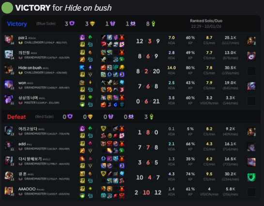
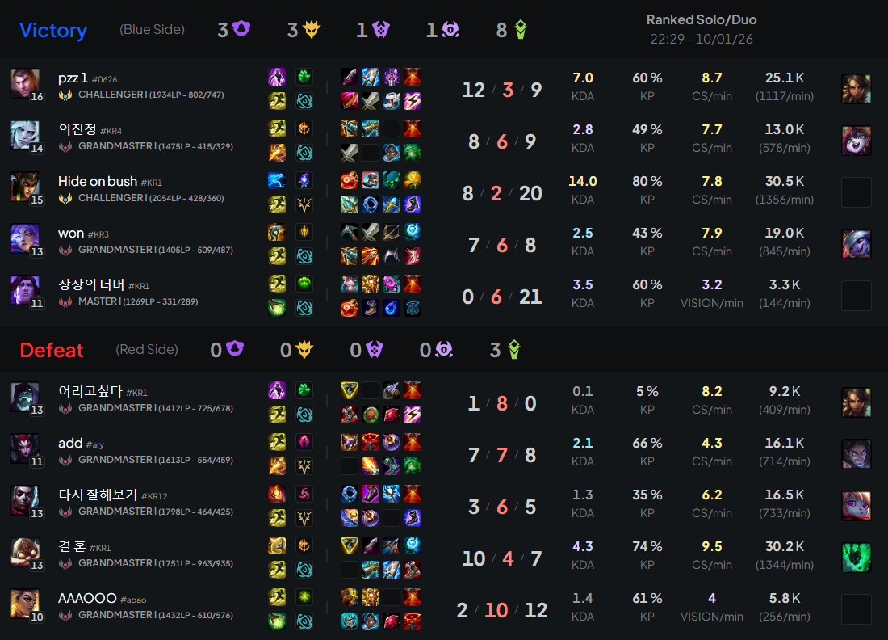

## 👋 WELCOME

```yaml
Welcome to the 3rd version of Match Logger.

Match Logger is a Discord bot that sends in a Discord channel each time a player starts or finishes a League of Legends game.

The list of whitelisted games mode for the bot are :
- Swiftplay
- Ranked FLEX
- Ranked SOLO/DUO
- Blind Pick
- Normal Draft

The process is very simple. You set up the bot and Riot API keys, then on Discord you use the /adduser command to add a player to the list of players to look after.

When the bot detects a new game, it will send an image that summarises the game data. The bot also counts how many wins and losses it registers to display a global winrate.

Obviously, this bot is not made to look after other players (or known people), but to know when your group of friends has played a game (and how it went).

Anyway, I cannot control what you will do with this.. It is you and yourself.
```

- Preview of a message sent by the bot. <br>

- Preview of the image sent with the message. <br>


## ⚖️ LICENSE

```yaml
This repository is under MIT Licence.
If you reupload this code / bot, please also use the MIT Licence and give me credit for it.

It seems I can't find the original source of all the .svg used in the project.
They are not made by me, so please send me the link if you find them to give them credit.
```
- See [LICENCE](/LICENCE) for more information.

## 🚨 RIGHTS

```yaml
"Match Logger V3" is not endorsed by Riot Games and does not reflect the views or opinions of Riot Games or anyone officially involved in producing or managing Riot Games properties. Riot Games and all associated properties are trademarks or registered trademarks of Riot Games, Inc
```

## 🧮 HOW IT WORK

```yaml
The code structure:

/src/output.css: Tailwind CSS file used for the HTML and image display.


/svg: Contains all svgs used by the Discord bot.

main.js: Main file, single file for easier use / set up.

settings.json: JSON file that stores all players, wins & losses, API version and channel id.

tierlist.json: Tierlist of where a champion is most played. This is made to try to guess on wich lane a player is playing in a spectator match.

How the bot works:
1. The bot looks at settings.json.
2. Loop all players and fetch Riot API to see if they are currently playing or if they have finished a game.
3. Then, it stores the game in a process list.
4. When the bot processes a game, it gets all the required data from the Riot API and picks what it needs to generate an HTML code that will be converted to an image.
5. When it is done. The Discord bot sent the image on your Discord channel.

The bot can go up to 5 games in the past when it checks for each player. When you add a new player, the bot stores directly its latest game, so no game image is sent on Discord when you add a player.
```

## ⚒️ SETUP

1. Install the dependencies with
```powershell
npm install -y
```
2. Run the bot with
```powershell
npm start
```
3. Add a player with /adduser command.
```
/adduser region name#tag
```
4. Enjoy!
